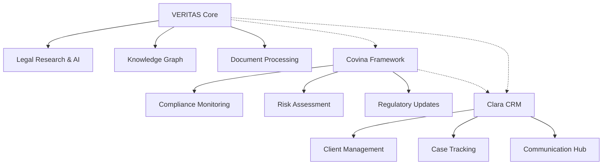

# VERITAS System - Architektur und Systemübersicht

## Executive Summary

VERITAS ist ein hochmodernes Legal Tech System, das Künstliche Intelligenz, Knowledge Graph Technologie und fortschrittliche Datenverarbeitung kombiniert, um juristischen Fachkräften eine intelligente Recherche- und Analyseplattform zu bieten. Das System ist Teil eines größeren Ecosystems bestehend aus VERITAS (Kern-KI-System), Covina (Compliance-Framework) und Clara (Client Relationship Management).

## Systemarchitektur

### Architekturprinzipien

VERITAS folgt einer **modularen, thread-sicheren OOP-Architektur** mit klarer Trennung von:

- **Core Engine** (`veritas_core.py`) - Backend-Services und Thread-Management
- **Application Layer** (`veritas_app.py`) - GUI und Benutzerinteraktion
- **API Management** (`veritas_api_manager.py`) - Service-Orchestrierung
- **Pipeline Framework** - Datenverarbeitung und Export
- **UI Framework** - Moderne Benutzeroberfläche
- **Knowledge Graph Engine** - Semantische Datenverarbeitung

### Technologie-Stack

```
┌─────────────────────────────────────────────────────────────┐
│                    VERITAS ECOSYSTEM                        │
├─────────────────────────────────────────────────────────────┤
│  Frontend Layer    │ Tkinter + Forest Theme + Custom UI     │
│  Application Layer │ OOP-Architecture + Thread Management   │
│  Core Engine       │ Backend Processing + Queue System      │
│  Data Layer        │ SQLite + JSON + Knowledge Graphs      │
│  Integration Layer │ FastAPI + REST APIs + UDS3 Security   │
└─────────────────────────────────────────────────────────────┘
```

## Komponenten-Übersicht

### 1. Core Engine (`veritas_core.py`)
**Kernfunktionalität ohne GUI-Abhängigkeiten**

- **Thread Management System** - Thread-sichere Orchestrierung
- **Queue-basierte Nachrichtenkommunikation** - Asynchrone Verarbeitung
- **Backend API Integration** - Externe Service-Anbindung
- **Session Management** - Benutzer- und Sitzungsverwaltung
- **UDS3 Integration** - Sicherheitsframework

### 2. Application Layer (`veritas_app.py`)
**Hauptanwendung mit moderner GUI**

- **ModernVeritasChatGUI** - Benutzeroberfläche
- **Multi-Window-Management** - Flexible Fensterarchitektur
- **OOP-Architektur** - Saubere Objektstruktur
- **UDS3 v3.0 Integration** - Erweiterte Sicherheit

### 3. API Management (`veritas_api_manager.py`)
**Intelligenter Service-Manager**

- **Port-Management** - Automatische Port-Erkennung
- **Dependency-Checks** - Systemvalidierung
- **Process-Management** - Service-Überwachung
- **Smart Startup** - Intelligente Initialisierung

### 4. Pipeline Framework
**Datenverarbeitung und Export**

- **Standard Pipeline Orchestrator** - Workflow-Management
- **Export Pipeline** - Produktionsexport
- **Installation Builder** - Deployment-Automation

### 5. Knowledge Graph Engine
**Semantische Datenverarbeitung**

- **KGE Development Roadmap** - Embedding-Strategien
- **Relations Almanach** - Relationship-Katalog
- **Production Manager** - Automatisierte Aktualisierungen

## Zusammenspiel im Ecosystem

### VERITAS ↔ Covina ↔ Clara Integration



**Integration Points:**
- **VERITAS → Covina**: Compliance-konforme Datenverarbeitung
- **VERITAS → Clara**: Client-spezifische Rechercheergebnisse
- **Covina → Clara**: Compliance-Status in Client-Records

## Datenfluss und Verarbeitung

### 1. Eingangsdaten
- **Legal Documents** (PDF, DOC, HTML)
- **User Queries** (Natural Language)
- **External APIs** (Rechtsdatenbanken)

### 2. Verarbeitungspipeline
1. **Document Ingestion** - Dokumentenaufnahme
2. **Content Extraction** - Textextraktion
3. **Semantic Analysis** - KI-basierte Analyse
4. **Knowledge Graph Integration** - Semantische Verknüpfung
5. **Response Generation** - Antwortgenerierung

### 3. Ausgabedaten
- **Structured Responses** - Formatierte Antworten
- **Knowledge Graphs** - Semantische Netzwerke
- **Export Packages** - Produktionsdaten

## Sicherheitsarchitektur

### UDS3 v3.0 Security Framework
- **Module Protection Keys** - Lizenzschutz
- **Organization-basierte Lizenzierung** - Mandantenfähigkeit
- **File Integrity Checks** - Manipulationsschutz
- **Graduated Protection Levels** - Skalierbare Sicherheit

### Datenschutz
- **Local Processing** - On-Premise Verarbeitung
- **Encrypted Communication** - Sichere Übertragung
- **Access Control** - Rollenbasierte Berechtigung

## Performance und Skalierung

### Thread-Management
- **Queue-basierte Kommunikation** - Non-blocking Operations
- **Multi-Window Support** - Parallele Benutzeroberflächen
- **Resource Pooling** - Effiziente Ressourcennutzung

### Datenbank-Performance
- **SQLite Optimierung** - Lokale Performance
- **JSON-Schema Management** - Flexible Datenstrukturen
- **Bulk Operations** - Batch-Verarbeitung

## Deployment und Distribution

### Installation Framework
- **Self-extracting Packages** - Einfache Installation
- **Dependency Management** - Automatische Abhängigkeiten
- **Configuration Management** - Zentrale Konfiguration

### Production Pipeline
- **Automated Export** - Produktionsbereitstellung
- **Quality Assurance** - Integrierte Tests
- **Version Management** - Releasezyklen

## Monitoring und Wartung

### System Monitoring
- **API Health Checks** - Service-Überwachung
- **Performance Metrics** - Leistungsmetriken
- **Error Tracking** - Fehlerprotokollierung

### Maintenance Features
- **Automated Updates** - Selbstaktualisierung
- **Backup Systems** - Datensicherung
- **Log Management** - Protokollverwaltung

## Zukunftsperspektiven

### Technologische Roadmap
1. **Advanced KGE Integration** - Erweiterte Graph-Embeddings
2. **Multi-Modal AI** - Text, Audio, Visual Processing
3. **Cloud-Hybrid Architecture** - Skalierbare Infrastruktur
4. **Real-time Collaboration** - Echtzeitkooperation

### Ecosystem Evolution
1. **Covina Enhanced Compliance** - Erweiterte Compliance-Features
2. **Clara Advanced CRM** - KI-gestützte Client-Insights
3. **Cross-Platform Integration** - Plattformübergreifende Synchronisation

---

*Diese Dokumentation bietet einen umfassenden Überblick über die VERITAS-Systemarchitektur. Detaillierte Informationen zu einzelnen Komponenten finden Sie in den spezifischen Moduldokumentationen.*

## Öffentliche Verwaltung: Kontext, Anforderungen und Compliance

Auf Basis der Dokumente aus `veritas/docs` werden folgende Querschnittsanforderungen für den Einsatz in Behörden adressiert:

- EU AI Act: Hochrisiko-Klassifikation für Systeme zur Entscheidungsunterstützung im Verwaltungsrecht mit strengen Anforderungen an Risikomanagement, Daten-Governance, Protokollierung, Transparenz, menschliche Aufsicht und Robustheit. Siehe: „00 _ KI-Integration in Behördenprozesse.md“ und „01 _ Ein umfassendes Strategiepapier…“.
- DSGVO/DSFA: Verpflichtende Datenschutz-Folgenabschätzung, Zweckbindung, Datenminimierung, Nachvollziehbarkeit und Betroffenenrechte. Siehe: „00 _ KI-RAG für Verwaltungsrecht planen_.md“.
- Plattform statt Piloten: Aufbau einer wiederverwendbaren, föderierten Plattform (Bund/Länder/Kommunen) statt isolierter Projekte. Siehe: „02 _ Navigierung der übersehenen Themenfelder…“.
- Interoperabilität & Standards: Standardisierte Schnittstellen, Austauschformate und Protokolle (z. B. JSON-Schema, OpenAPI, DCAT, eIDAS, XÖV-Standards) für eine behördenübergreifende Skalierung.
- Betriebsmodelle: On-Premise/Hybrid mit Datenhoheit, segmentierten Netzen, Härtung und reproduzierbaren Deployments.

Diese Anforderungen sind in der VERITAS-Architektur wie folgt verankert:

- Governance by Design: Covina übernimmt Compliance-Orchestrierung (DSFA, Policy-Enforcement, Audit-Trails), Clara verankert Prozesse, Rollen, Mandanten-Interaktion und Qualitätssicherung. VERITAS liefert die KI-Funktionalität und Nachvollziehbarkeit.
- Auditierbarkeit: Einheitliche Protokollierung in Core, API und Pipeline; unveränderliche Logs für DSFA/AI-Act-Nachweise; Export/Installer mit Integritätsprüfungen.
- Erklärbarkeit: Knowledge Graph + RAG-Pipelines liefern Quellen-Attributionen, Evidenzen und Begründungsstrukturen; UI visualisiert Herkunft und Vertrauenswert.
- Barrierefreiheit: UI Framework nach BITV 2.0/WCAG mit TTS, Tastatursteuerung und responsiver Darstellung; Mehrsprachigkeit einplanbar.

## Rolle von VERITAS, Covina und Clara im öffentlichen Sektor

- VERITAS: KI-Kern (RAG, Knowledge Graph, Orchestrierung). Liefert rechtlich begründbare Antworten mit Quellenbindung, Qualitätsmetriken und Evidenzketten.
- Covina: Compliance- und Risiko-Framework. Governed Data Pipelines, Policy-Checks, DSFA-Artefakte, AI-Act-Konformität, Audit und Freigaben.
- Clara: CRM/Case-Management. Kontextualisiert Anfragen (Fall, Behörde, Rolle), orchestriert menschliche Aufsicht, Dokumentation und Übergaben.

Die Interaktionen sind so gestaltet, dass jeder behördliche Nutzungsschritt nachvollziehbar ist: Anfrage → Retrieval/Reasoning → Evidenzen → menschliche Prüfung → Entscheidungsvorbereitung → Archiv/Audit.

## Plattformarchitektur statt isolierter Pilotprojekte

Gemäß „02 _ Navigierung der übersehenen Themenfelder…“ folgt VERITAS einer Plattform-Denke:

- Modularität: Wiederverwendbare Bausteine (Core, API, UI, Pipeline, KGE) mit klaren Verträgen.
- Föderation: Instanzen auf Bundes-/Landes-/Kommunalebene, synchronisiert über standardisierte Export-/Importpfade.
- Lebenszyklus: Von der Datenaufnahme über Validierung bis zur Veröffentlichung inkl. Qualitätssicherung und operativer Kennzahlen.

## Compliance-Mapping (EU AI Act und DSFA)

- Risikomanagement: Pipeline-Orchestrierung mit Quality-Gates, Testfällen und Rollback-Strategien.
- Daten-Governance: Schema-getriebene Datenflüsse, Herkunftsnachweise (Provenance), DQ-Checks, Versionierung.
- Protokollierung: Einheitliche Logs über Core, API, UI, Pipelines; manipulationsresistente Exportpfade.
- Transparenz/Erklärbarkeit: Quellenangaben, Begründungsgraphen, UI-Hinweise; erklärbare KGE-Konzepte.
- Menschliche Aufsicht: Rollen-/Freigabeketten in Clara; Vier-Augen-Prinzip; Eskalationspfade.
- Sicherheit/Resilienz: Härtung, Netzsegmentierung, Least Privilege, Failover und Self-Healing im API-Manager.

Verweise:
- `veritas/docs/00 _ KI-Integration in Behördenprozesse.md`
- `veritas/docs/00 _ KI-RAG für Verwaltungsrecht planen_.md`
- `veritas/docs/01 _ Ein umfassendes Strategiepapier für ein KI.docx.md`
- `veritas/docs/02 _ Navigierung der übersehenen Themenfelder der KI in der öffentlichen Verwaltung.docx.md`